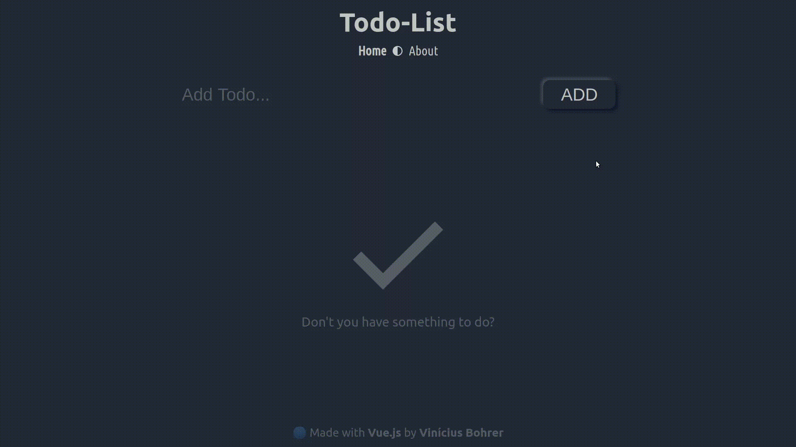
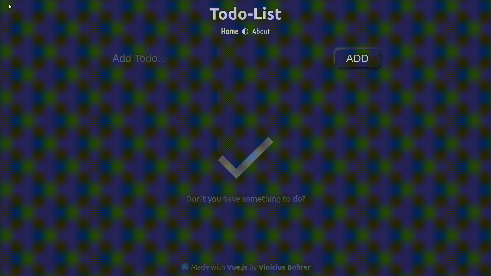
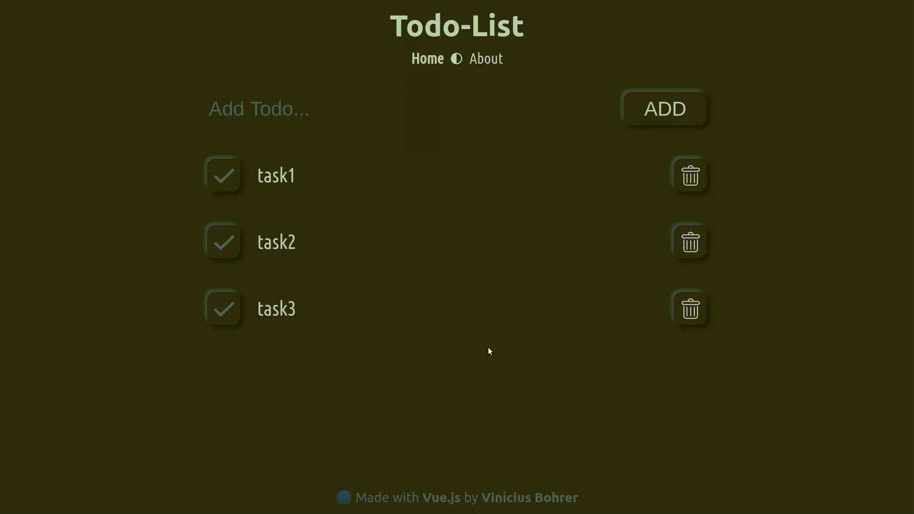
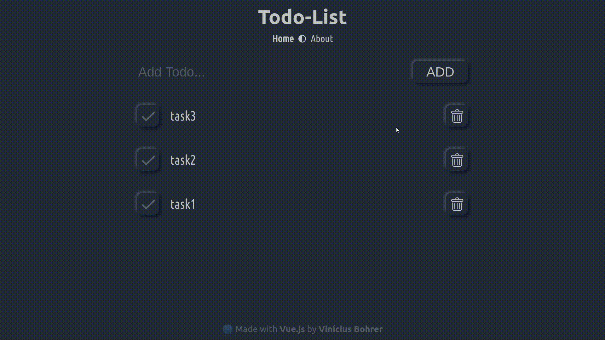

# Basic todo-list app made with Vue.js

App made to learn the basics of vue, vuex and vue-router.

### Change routes and theme

### Create tasks

### Edit tasks

### Reorder taks

### Undo (CTRL + Z) and Redo (CTRL + Y) your actions

